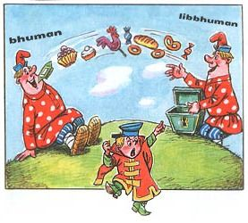
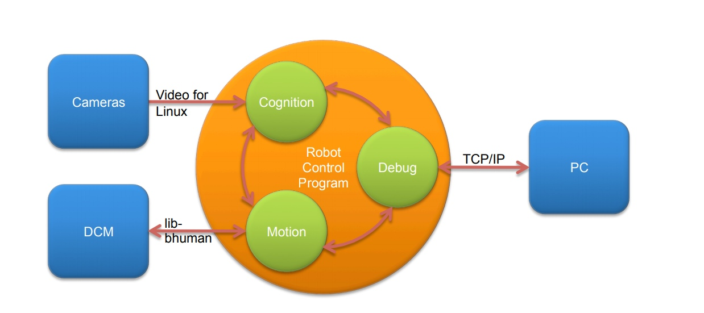
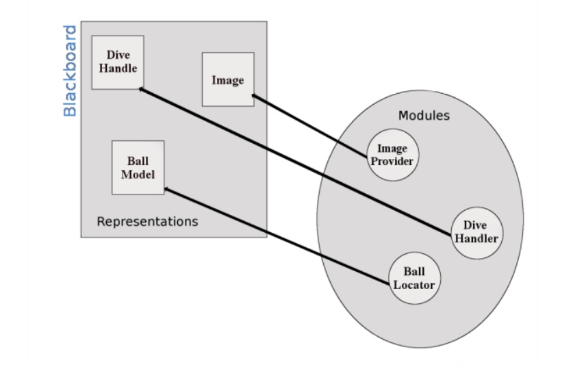

# B-Human Фреймворк. Архитектура

Наша команда использует фреймворк немецкой команды B-Human, разработанный при участии:

* University of Bremen;

* German Research Center for Artificial Intelligence (DFKI).

Начиная с 2009 года этот фреймворк используется многоми командами.
 Есть документации на каждый год:
 
 * https://www.b-human.de/downloads/publications/2018/CodeRelease2018.pdf
 * https://www.b-human.de/downloads/publications/2017/coderelease2017.pdf
 * https://www.b-human.de/downloads/publications/2016/coderelease2016.pdf
 * ...
 
# Основные модули 

 Сервы и датчики (за исключением камеры) NAO доступны с помощью *NAOqi SDK*, 
 который полноценно не используется. Для этих целей они на базе NAOqi SDK реализовали
 модуль **libbhuman** для доступа к моторам и датчикам из отдельного модуля, который и 
 называется **bhuman**
 
Каждую итерацию, **libbhuman** считывает новый набор значений всех датчиков, после чего
записывает их в общий блок памяти и вызывает семафор. Процесс **bhuman** ожидает
семафор, считывает значения датчиков и вызывает *Motion* модули для их обработки. Далее записывает
полученные значения обратно в общий блок памяти. Эти значения принимаются модулем **libbhuman**
и записываются в сами датчики.



Весь этот функционал можно было бы реализовать в рамках одного модуля, но решение с 
отдельными модулями имеет явные преимущества:

* Оба модуля используют своё собственное адресное пространство без заметного снижения 
производительности. Таким образом, неисправность процесса **bhuman** не может повлиять 
на **libbhuman** (*NAOqi*) и наоборот

* Всякий раз, когда **bhuman** выходит из строя, **libbhuman** все еще может отображать
эту неисправность с помощью красных мигающих светодиодов и заставлять *NAO* медленно 
садиться.


# Процессы

Большинство программ робота используют параллелизм. Количество параллельных процессов 
лучше всего определить через внешние требование, исходящие от самого робота или от
его операционной системы.

Nao получает изображение от каждой камеры на частоте 30 Гц и принимает новые 
положения сервомоторов на 100 Гц. Поэтому основные процессы 
выглядят так:




* `Cognition` - каждый цикл выполнения по очереди получает и обрабатывает изображения 
с двух камер. А так же обрабатывает данные сенсеров, полученные от процесса `Motion`
    
    * **Вход:** Изображения и данные с сенсоров
    * **Выход:** Высокоуровневые команды для `Motion` 
* `Motion` - по сути каждый цикл выполнения (100 ГЦ) генерирует положения для всех
25 моторов, выполняя высокоуровневые команды, полученные от `Cognition`:
    * **Вход:** Все данные от **libbhuman**: показание сенсеров и положения моторчиков -
    распределяются. Сенсоры отправляются в `Cognition`, положение моторчиков обрабатываются
    * **Выход:** Новые положения для моторчиков отсылаются обратно в **libbhuman**
    
#  Module и Representation

Обычно выполняющаяся на роботе программа состоит из нескольких модулей (**Module**), каждый из которых 
выполняет определённую задачу: обработка изображения, локализация или ходьба. Любой модуль 
на вход требуют определённые данные и после обработки производит какие-нибудь данные. Так вот 
эти данные, которыми общаются модули, и называются **Representation**.

Этот фреймворк использует особый протокол, который позволяет легко создавать собственные
*модули* и автоматически определяет порядок их исполнения. Протокол состоит из 
**blackboard** (хранилище данных), **module defenition** (правила определения модулей) 
и компоненты для визуализации.




## Blackboard

**Blackboard** - центральное хранилище всей информации (а-ля для **Representation**).
*Blackboard* на самом деле отображает название каждого *Representation* на 
ссылку на экземляры этого *Representation*. *Representations* передаются через межпроцессорную
связь, если какому-нибудь модулю понадобится экземпляр.


## Representations

**Representation** - это классы с информацией, которую передают друг другу модули. Этот
тип является лишь частью понятия **Streamable** (можно ознакомиться 
[здесь](https://www.b-human.de/downloads/publications/2017/coderelease2017.pdf) на 33 стр). Весь
фреймворк построен на макросах, по которым генерируется код,
и *representation* не исключение. Для того, чтобы описать
новый класс, которым модули смогут общаться, есть два способа.
 * Первый следующий:
 
 ```
STREAMABLE(<class>,
{
    <header>,
    <comma-separated-declarations>,
})

```

* Второй очень похожий:
```
STREAMABLE_WITH_BASE(<class>, <base>, ...)
```

И вот что означают параметры:
 * **class** - название структуры, которую нужно определить
 
 * **base** - класс, от которого наш унаследуется
 
 * **header** - Все, что может быть частью тела класса, за исключением 
атрибутов, которые должны быть **streamable**, и конструктором по умолчанию

* **comma-separated-declarations** - Объявления атрибутов в 
четырех возможных формах: 

    ````
    ( <type> ) <var>
    
    ( <type>) ( <init> ) <var>
    
    (( <enum-domain>) <type>) <var>
    
    (( <enum-domain>) <type>) ( init ) <var>
    ````
    
    * **type** - тип определяемого атрибута
    
    * **var** - имя определяемого атрибута
    
    * **init** - параметры инициализации для атрибута, это может быть либо значение, либо
    параметры, передаваемые в конструктор
    
    * **enum-domain** - название *Enum* класcа. В халявной версии туториала этого нет, 
    но есть в 
    [исходной](https://www.b-human.de/downloads/publications/2017/coderelease2017.pdf)
     документации на странице *38* 
     

### Пример:
Файл `Src/Representations/Configuration/BallSpecification.h`

```
#include "Tools/Modeling/BallPhysics.h"
#include "Tools/Streams/AutoStreamable.h"

STREAMABLE(BallSpecification,
{
public:
    float ballSpeedUpperBound() const
    {
        return BallPhysics::velocityForDistance(kickDistanceUpperBound, friction);
    },

    (float)(50.f)    radius,
    (float)(-0.13f)  friction,
    (float)(20000.f) kickDistanceUpperBound, 
});

```

## Module 

*Module* - это программная единица, которая на вход получает определённые данные, обрабатывает их
и сохраняет в *blackboard* для следующих функций. Определение *Module* выполняется так же 
с помощью макроса и состоит из трёх частей: интерфейс модуля, его реализация и оператор, который
 позволяет создать экземпляр модуля
 


### Пример
Он вымышленный, но все модули располагаются в `src/Modules/`, и далее каждый в тематической папке. Этот
располагался бы в `src/Modules/Modeling`

```
MODULE(SimpleBallLocator,
{,
    REQUIRES(BallPercept),
    REQUIRES(FrameInfo),
    PROVIDES(BallModel),
    DEFINES_PARAMETERS (
    {,
        (Vector2f)(5.f, 0.f) offset ,
        (float)(1.1f) scale,
    }),
});

class SimpleBallLocator:public SimpleBallLocatorBase
{
    void update(BallModel& ballModel)
    {
        if (theBallPercept.wasSeen)
        {
            ballModel.position = theBallPercept.position*scale + offset;
            ballModel.wasLastSeen = theFrameInfo.frameTime;
        }
    }
}
MAKE_MODULE(SimpleBallLocator, modeling);
```

# Важно!

* Все *representations* указываются в `Config/Scenarios/Default/modules.cfg`


# Вывод
Разработка на этом фреймворке довольно проста и удобна, так как работу можно разделить 
незваисимо при помощи модульной архитектуры.