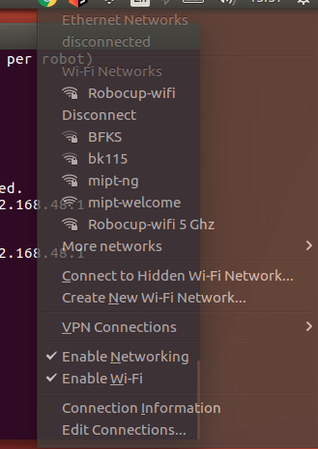

Инструкция по загрузке кода B-Human на робота.

*Необходимо:*

* Робот
* Ethernet кабель
* Выполненная [инструкция](https://github.com/SPQRTeam/SPQR-Starkit/wiki) по компиляции кода b-human, написанная командой SPQR 

*Подготовка:*
* Включите нао
* Поставьте на зарядку
* Подключите ноутбук к роботу с помощью Ethernet кабеля
* Запишите где-нибудь Ip робота (достаточно нажать на кнопку на груди). Допустим это 169.254.215.193

# Настройка статического IP

Для начала нужно настроить параметры сети. Для этого сверху справа
 нажмите на значок сети, а далее `edit Connections`




Далее следует выбрать сеть, которая обеспечивает соединение с роботом.
 Следом перейти на вкладку `IPv4 Settings` и заполните поля, как на изображении ниже.


* 192.168.\*.\*  - для единообразия адреса
* \*.\*.48.\*  - так как в гейм-контроллере наша команда имеет номер 48
* \*.\*.\*.120 - чтобы не занимать маленькие значение, а оставить их для роботов

Теперь всё готово для настройки робота!

# Создание профиля робота

Каждый робот принадлежит определённой команде и имеет уникальный номер и имя. 
А также хочется не узнавать каждый раз IP робота, а сделать его статическим.

Эти идеи и послужили мотивацией к созданию конфигурации роботов. 
Рассмотрим эту процедуру на примере робота *Ivan*. Стоит напомнить, что его `IP=169.254.215.193`.

Для начала перейдите в папку `Install`. Выполните следующие команды, но для нового робота.
Номера роботов уже выбраны и записаны в [trello](https://trello.com/c/3Npw79ys/17-%D1%83%D1%81%D1%82%D0%B0%D0%BD%D0%BE%D0%B2%D0%BA%D0%B0-%D0%BA%D0%BE%D0%B4%D0%B0-b-human-%D0%BD%D0%B0-%D1%80%D0%BE%D0%B1%D0%BE%D1%82%D0%BE%D0%B2)

 * `./createRobot -t 48 -r 1  Ivan`

Создаём конфигурацию робота. Флаг `-t 48` указывает на принадлежность к 48-ой команде. 
Флаг `-r 1` задаёт номер робота. В конце указывается имя. 

**Замечание** Если вы хотите изменить уже созданный файл конфигураций, то перед именем стоит добавить флаг `-d`. 

* `./addRobotIds -ip 169.254.215.193 Ivan`

Эта команда связывает headId и bodyId каждого робота с его именем. 
Так как указа `-ip`, то скрипт напрямую узнаёт эти идентификаторы

* `./installRobot 169.254.215.193`

Отправляем файлы конфигураций на робота. Теперь он готов к загрузке основного кода.

**Важно:** После выполнения этой команды робот перезагрузится, поэтому придержите его.


# Загрузка основного кода на робота

Для начала убедитесь, что в предыдущем пункте всё сделали правильно - подключитесь к роботу по ssh:

```ssh nao@192.168.48.1```

**Важно:** как можно заметить, ip робота изменился. Теперь он соответсвует данному роботу.

Теперь стоит перейти в папку `Make/<OS>` и выполнить скрипт copyfiles:

```./copyfiles Release -r 1 192.168.48.1```

Где после флага `-r` следует номер робота

Теперь можно зайти на робота через ssh и выполнить запуск фреймворка:

```bhumand start```