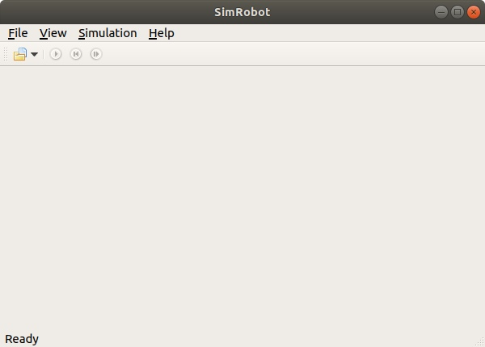
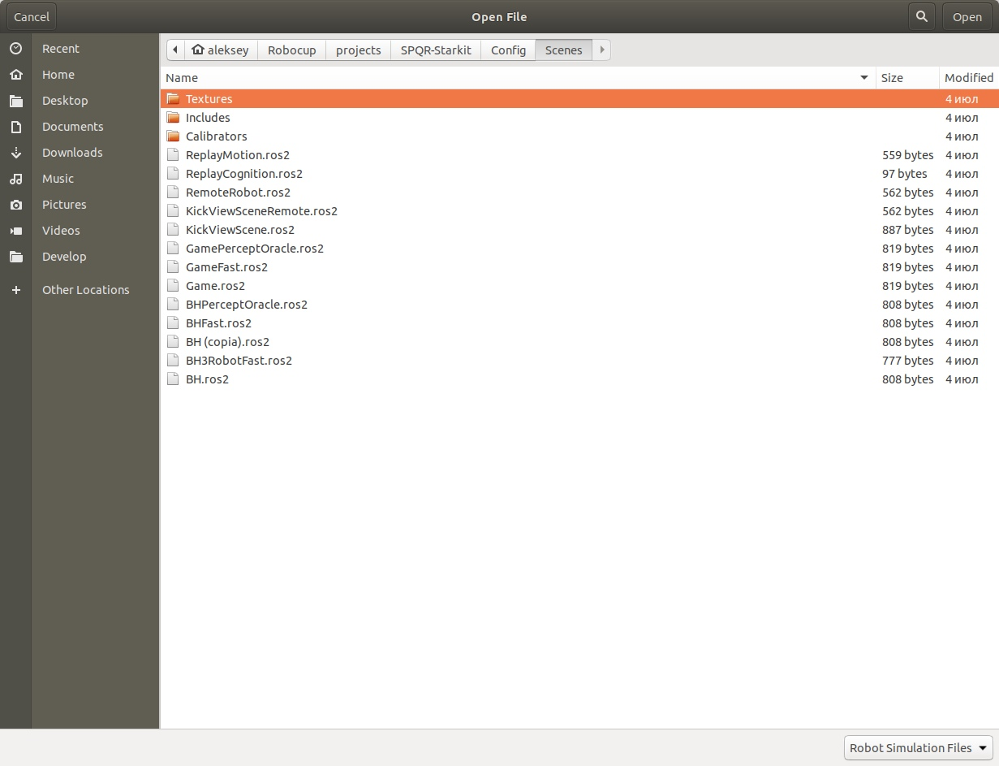
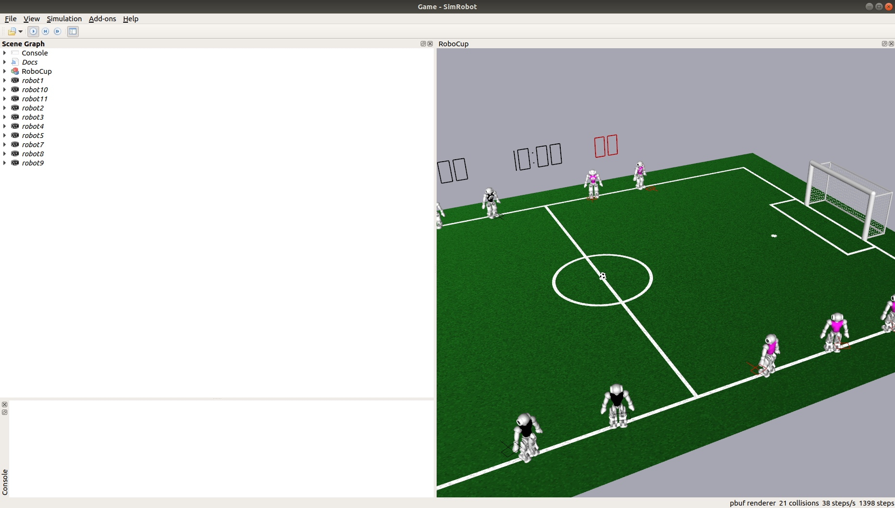

# Работа с SimRobot
## Запуск SimRobot

* Корректно скомпилировать проект по [гайду](installation_b_human.md)
* Перейти в папку `Build/Linux/SimRobot/<Develop/Debug/Release>/`
* Запустить `$ ./SimRobot`

Должно появиться следующее окно:

## Выбор сценария
Основная работа с симулятором происходит в каком-нибудь сценарии. 
Для того, чтобы его выбрать нужно:
* Нажать `file->open` (`Ctrl+O`)
* В открывшемся окне зайти в папку `Config/Scenes`
* И выбрать один из файлов `*.ros2`:

## Виды сценариев
* `RemoteRobot.ros2` - Запускать только в **Debug** версии

Сценарий для соединения с настоящим роботом. 
В основном используется для калибрации робота

* `Game.ros2`

Полноценный симулятор

* `GameFast.ros2`

То же самое, что и `Game.ros2`, только роботам сообщаются их координаты и координаты мяча.

## Настройка рабочего пространства

При первом запуске любого сценария, будут открыты лишь две вкладки: `Scene Graph` и `RoboCup`.

Любое взаимодействие со средой происходит через консоль, которую нужно открыть
 *двойным нажатием* на `Console` в `Scene Graph`
 
 ## Основные команды консоли
 Консольные команды вводятся напрямую в окно `Console`. Всего есть два типа команд. 
 Первый тип - *глобальные команды*, они меняют состояние симуляции. Второй тип - *команды роботам*, которые посылаются 
 заранее выбранному роботу.
 
 Вот основные *глобальные команды*:
 - **ar on** | **off**
 
 
 Включает либо отлючает автоматическое судейство
 
 - **cls**
 
 Очищает окно консоли
 
 - **dt on** | **off**
 
Включает либо отключает 
синхронизацию времени симуляции с реальным временем. По умолчанию включена.

- **gc initial | ready | set | playing | finished | kickOffBlue | kickOffRed | outByBlue |
outByRed | gameDropIn | gamePlayoff | gameRoundRobin**

Самая полезная команда! Изменяет текущее состояние гейм-контроллера

- **sc \<name\> <a.b.c.d>**

Запускает удалённое соединение с роботом по ip `\<a.b.c.d\>` и сохраняет его под именем
`\<name\>`. Важно запускать в режиме **Debug** 

- **robot ? | all | <name> {<name>}**

Команда позволяет выбрать всех роботов, группу или конкретного, 
при выполнении с параметром `?` выведет список подключенных роботов. 

Теперь можно перейти к *командам роботам*. Эти команды выполняются для выбранных роботов.
Если запускался сценарий `RemoteRobot.ros2`, то по умолчанию доступен лишь 
подключённый робот, дополнительных можно подключить при помощи команды `sc`. Итак,
 основные команды следующие:
 
- **ac both | upper | lower**

- **bc <red%> <green%> <blue%>**

- **cameraCalibrator <view> (on | off)**

- **ci off | on \[\<fps\>\]**

- **dr ? \[\<pattern\>\] | off | \<key\> ( off | on )**

- **get ? \[\<pattern\>\] | \<key\> \[?\]**

- **jc hide | show | motion ( 1 | 2 ) \<command\> | ( press | release ) \<button\>
\<command\>**

- **jm \<axis\> \<button\> \<button\>**

- **js \<axis\> \<speed\> \<threshold\> \[\<center\>\]**

- **kick**

- **mv \<x\> \<y\> \<z\> \[\<rotx\> \<roty\> \<rotz\>\]**

Moves the selected simulated robot to the given metric position. x, y, and z have to be
specified in mm, the rotations have to be specified in degrees. Note that the origin of the
NAO is about 330 mm above the ground, so z should be 330.

- **mvb \<x\> \<y\> \<z\>**

Moves the ball to the given metric position. x, y, and z have to be specified in mm. Note
that the origin of the ball is about 32.5 mm above the ground.

- **pr none | illegalBallContact | playerPushing | illegalMotionInSet | inactivePlayer |
illegalDefender | leavingTheField | kickOffGoal | requestForPickup | manual**

Penalizes a simulated robot with the given penalty or unpenalizes it, when used with none.
When penalized, the simulated robot will be moved to the sideline, looking away from the 
field. When unpenalized, it will be turned, facing the field again, and moved to the sideline
that is further away from the ball.

- **si reset | ( upper | lower ) \[number\] \[\<file\>\]**

Saves the raw image of a robot. The image will be saved as bitmap file. If no path is
specified, Config/raw image.bmp will be used as default option. If number is specified, a
number is appended to the filename that is increased each time the command is executed.
The option reset resets the counter.

- **set ? \[\<pattern\>\] | \<key\> ( ? | unchanged | \<data\>)**

- **save ? \[\<pattern\>\] | \<key\> \[\<path\>\]**

- **v3 ? \[\<pattern\>\] | \<image\> \[jpeg\] \[\<name\>\]**

Adds a set of 3-D color space views for a certain image (cf. Sect. 10.1.4.1). The image can
either be the camera image (simply specify image) or a debug image. It will be JPEG
compressed if the option jpeg is specified. The last parameter is the name that will be
given to the set of views. If the name is not given, it will be the same as the name of the
image. A question mark followed by an optional filter pattern will list all available images.

- **vf \<name\>**

Adds a field view (cf. Sect. 10.1.4.1). A field view is the means for displaying debug
drawings in field coordinates. The parameter defines the name of the view.

- **vfd ? \[\<pattern\>\] | ( <name> | all ) ( ? \[\<pattern\>\] | \<drawing\> ( on | off ) ) | of**

(De)activates a debug drawing in a field view. The first parameter is the name of a field
view that has been created using the command vf (see above) or all to add the drawing
to all field views. The second parameter is the name of a drawing that is defined in the
robot control program. Such a drawing is activated when the third parameter is on or is
missing. It is deactivated when the third parameter is off. The drawings will be drawn
in the sequence they are added, from back to front. Adding a drawing a second time will
move it to the front. A question mark directly after the command will list all field views
that are available. A question after a valid field view will list all available field drawings.
Both question marks have an optional filter pattern that reduces the number of answers.
vfd off will turn off all debug drawings except for the background in all field views.

- **vi ? \[\<pattern\>\] | \<image\> \[jpeg\] \[segmented\] \[upperCam\] \[\<name\>\] \[ gain \<value\>\]**

Adds an image view (cf. Sect. 10.1.4.1). An image view is the means for displaying debug
drawings in image coordinates. The image can either be the camera image (simply specify
image), a debug image, or no image at all (none). It will be JPEG-compressed if the
option jpeg is specified. If segmented is given, the image will be segmented using the
current color table. The default is to show data based on the images taken by the lower
camera. With upperCam, the upper camera is selected instead. The next parameter is the
name that will be given to the set of views. If the name is not given, it will be the same as
the name of the image plus the word Segmented if it should be segmented. With the last
parameter the image gain can be adjusted, if no gain is specified the default value will be
1.0. A question mark followed by an optional filter pattern will list all available images.

- **vid ? \[\<pattern\>\] | ( \<name\> | all ) ( ? \[\<pattern\>\] | \<drawing\> ( on | off ) )**

(De)activates a debug drawing in an image view. The first parameter is the name of an
image view that has been created using the command vi (see above) or all to add the
drawing to all image views. The second parameter is the name of a drawing that is defined
in the robot control program. Such a drawing is activated when the third parameter is on
or is missing. It is deactivated when the third parameter is off. The drawings will be drawn
in the sequence they are added, from back to front. Adding a drawing a second time will move it to the front. A question mark directly after the command will list all image views
that are available. A question mark after a valid image view will list all available image
drawings. Both question marks have an optional filter pattern that reduces the number of
answers. vid off will turn off all debug drawings in all image views.

- **vp \<name\> \<numOfValues\> \<minValue\> \<maxValue\> \[\<yUnit\> \<xUnit\>
\<xScale\>\]**

Adds a plot view (cf. Sect. 10.1.4.5). A plot view is the means for plotting data that was
defined by the macro PLOT in the robot control program. The first parameter defines the
name of the view. The second parameter is the number of entries in the plot, i. e. the size
of the x axis. The plot view stores the last numOfValues data points sent for each plot
and displays them. minValue and maxValue define the range of the y axis. The optional
parameters serve the capability to improve the appearance of the plots by adding labels
to both axes and by scaling the time-axis. The label drawing can be activated by using
the context menu of the plot view.

- **vpd ? \[\<pattern\>\] | \<name\> ( ? \[\<pattern\>\] | \<drawing\> ( ? \[\<pattern\>\] | \<color\>
| off ))**

Plots data in a certain color in a plot view. The first parameter is the name of a plot
view that has been created using the command vp (see above). The second parameter is
the name of plot data that is defined in the robot control program. The third parameter
defines the color for the plot. black, red, green, blue, yellow, cyan, magenta, orange, violet,
gray, and six-digit hexadecimal RGB color codes are supported. The plot is deactivated
when the third parameter is off. The plots will be drawn in the sequence they were added,
from back to front. Adding a plot a second time will move it to the front. A question mark
directly after the command will list all plot views that are available. A question after a
valid plot view will list all available plot data. Both question marks have an optional filter
pattern that reduces the number of answers.

- **vd \<debug data\> (on | off )**

Show debug data in a window or disable the updates of the data. Data views can be found
in the data category of the scene graph. Data views provide the same functionality as the
get and set commands (see above). However they are much more comfortable to use.

